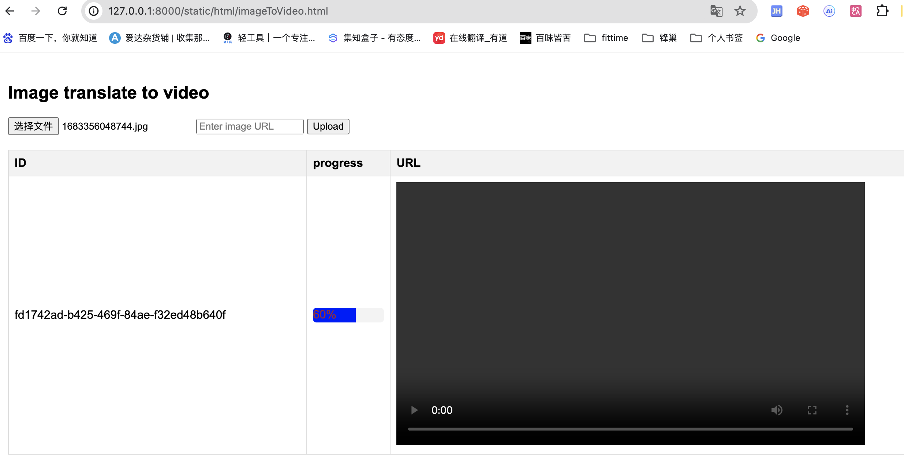
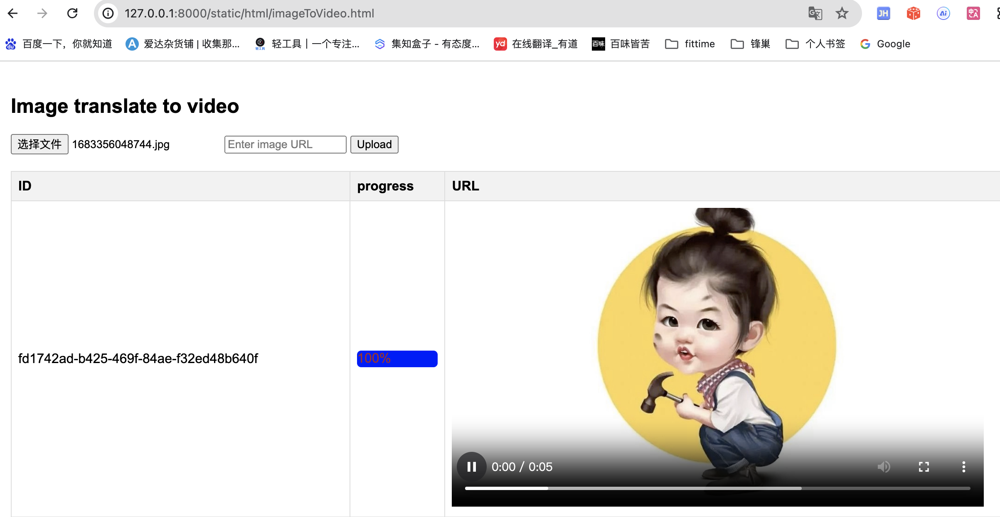

# A fastapi application developed in Python

## request

Design and implement a web application that allows users to upload an image and receive a generated video based on that image.
The system must handle the constraints of limited memory and simulate an artificial intelligence (AI) model that is resource-intensive and has a fixed processing time

设计和实现一个 Web 应用程序，允许用户上传图像并接收基于该图像生成的视频。系统必须处理有限内存的约束并模拟资源密集型且具有固定处理时间的人工智能(AI)模型

1. Image Upload:

- Users of our system should be able to upload an image via a web interface.
- The user upload frequency is higher than the model processing speed.
- Users should be able to see the current status of their video generation task. While processing, they should be able to see the percentage progress in real-time.

2. Simulated AI Model:

- Simulate the workflow of an AI model that processes each image to generate a video.
- The AI model should take 30 seconds to process an image.
- The model can only process one image at a time.
- You may use a sleep function to simulate the processing time.

3. Generated Video:

- After processing, the system should generate a video based on the uploaded image.
- The video should be viewable on the web interface.
- The video should be read-only; users should not be able to download it.

## design

1：I used Python's moviepy library to do the design, split the user's uploaded picture into a 5-frame video combination, and store the video locally
2：I limited the user's upload image size to 5M
3：I simulated the AI application's processing and queuing using celery and Redis
4：I use js to hide the video download button on the page, prohibit the function of the right mouse button, and use the streaming interface to obtain videos, so as to ensure the security of video resources

## code

1：Entry program is 【main.py】
2：the interface file is 【imageToVideo/image_to_video.py】
3：the celery task file is 【celery_task.py】
4：the html file is 【static/html/imageToVideo.html】

## Startup procedure

1：Install the required dependencies
2：Start the Redis service
3：Start the celery service 【celery -A celery_task.celery_app worker --loglevel=info】
4：Start the FastAPI service 【uvicorn main:app --host 127.0.0.1 --port 8000】
5：Open the browser and enter 【http://127.0.0.1:8000/static/html/imageToVideo.html】

## Test image

begin

finish

